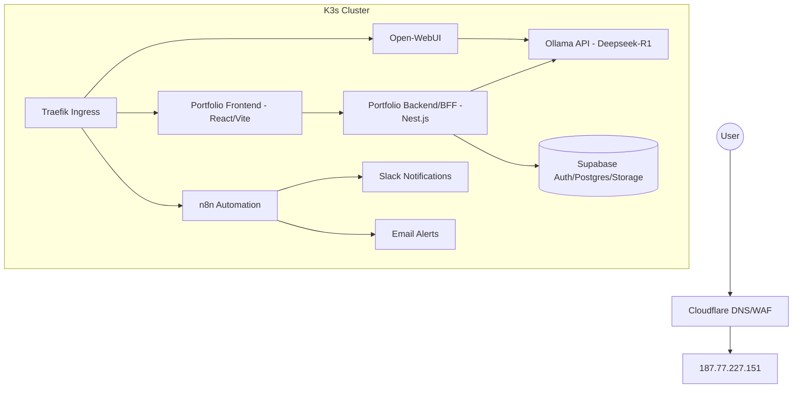

# 🧠 JPGLabs Portfolio & AI Hub — Documentation

## 🏗 Architecture Overview

The system is a self-hosted **AI Orchestration Hub** running on a single-node **k3s (Kubernetes)** cluster. It integrates a professional portfolio with a SaaS-ready AI resume parser and a fleet of automated agents.

This repository should now be treated as the **backend/BFF lane** for the
portfolio platform. The visual portfolio frontend lives in a separate React +
Vite repository and consumes the contracts defined here for auth, session,
protected APIs, upload workflows, and Supabase-backed persistence.

### 🌐 System Diagram



---

## 🚀Nest.js Backend / BFF

- **Framework:**Nest.js 14 (App Router)
- **Features:**
  - **Auth and Session Core:** SSO, credentials flow, protected-route session handling, timeout policy.
  - **Protected API Surface:** Route handlers consumed by the portfolio frontend and future mobile lane.
  - **Supabase Integration:** Contract owner for auth, profile metadata, audit, storage and generation workflows.
  - **Resume Intake Discovery:** The upload/curriculum flow is currently treated as a requirements and contract-definition phase, not as a finalized parser implementation.

### Authenticated Access

- **Login UX:** `/login` with GitHub, Google, and e-mail/password entry points.
- **Session Layer:** `next-auth` JWT session with five-minute inactivity timeout and ten-second warning modal.
- **Protected Routes:** `/dashboard/:path*` guarded before rendering.
- **Legal Pages:** `/terms` and `/privacy` linked directly from the login surface.

---

## ⚙️ Backend & API

The backend currently lives inside theNest.js Route Handlers and should be
treated as the first production backend/BFF lane for the platform.

This lane must be designed to support **hundreds or thousands of business
users**, which means:

- stateless web nodes and externalized state
- async boundaries for long-running or bursty work
- rate limiting and backpressure-aware integrations
- observability for latency, concurrency and saturation
- Supabase contracts that remain explicit enough to be replicated later

The future Java lane is not an immediate replacement. It is a **post-deploy,
final-epic replica track** that will mirror these contracts using the latest
Java LTS and Quarkus versions validated at implementation time.

### 📖 API Reference (Swagger-style)

| Endpoint | Method | Description | Payload |
| :--- | :--- | :--- | :--- |
| `/api/resume/parse` | `POST` | Temporary discovery/intake endpoint for resume requirements | `{ text: string }` |
| `/api/auth/[...nextauth]` | `GET/POST` | Handles GitHub, Google, and credentials auth | Session cookie |
| `/api/portfolio/generate` | `POST` | Saves generated data to Supabase | `PortfolioSchema` |

---

## 🤖 AI & Automations

### Ollama (Deepseek-R1)
- **Namespace:** `ai-services`
- **Model:** `deepseek-r1:7b`
- **Purpose:** Handles complex resume parsing and code explanation.

### n8n Workflow Fleet
1.  **Infrastructure Monitor:** Health checks for all domains every 5 mins.
2.  **WhatsApp Bot:** Secure chatbot with HMAC validation and rate limiting.
3.  **Kiwify Delivery:** Secured delivery pipeline with idempotency.

---

## 📦 Deployment & Ops

### CI/CD Pipeline
- **GitHub Actions:** `.github/workflows/deploy.yml`
- **Build:** Docker images built directly on VPS to optimize for local architecture.
- **Orchestration:** `kubectl rollout restart` for zero-downtime updates.

### Monitoring
- **Slack:** Real-time alerts for service downtime.
- **Email:** Redundant notifications for critical failures.

---

## 🛠 Project Structure

```text
portfolio/
├── app/                #Nest.js App Router
├── components/         # UI Components (Hero, ResumeUpload, etc.)
├── docs/               # Operational docs, RBAC, data model
├── k8s/                # Kubernetes Manifests
├── lib/                # Shared utilities (ollama, supabase, auth)
├── public/             # Static assets
└── Dockerfile          # Multi-stage production build
```

## 🗃 Data Model

- Current RBAC/auth schema: [docs/rbac_setup.sql](./docs/rbac_setup.sql)
- Detailed storage model for auth, legal acceptance, uploads, generations, and private assets: [docs/data-model.md](./docs/data-model.md)

## 🔭 Structure Review

- The current codebase should be treated as the backend/BFF lane for the portfolio platform, not as the primary visual frontend.
- Supabase must stay deeply documented as the current auth/data/storage boundary so the contracts can later be replicated by a separate Java + Quarkus backend.
- The `docs/data-model.md` file records the target storage contract, scale assumptions and replica constraints so the future Java lane can be implemented without rediscovering entities, audit requirements or privacy boundaries.
